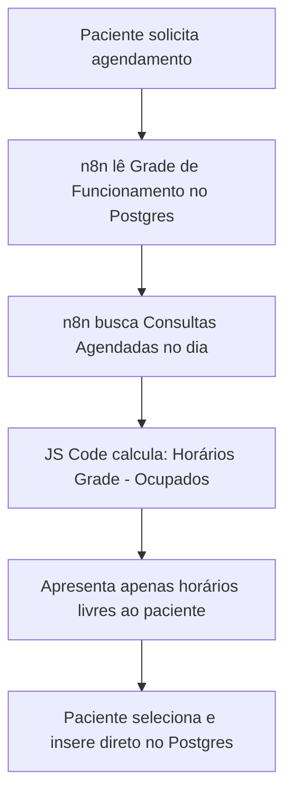

# ChatBot Secretária

[](LICENSE)
[](https://n8n.io/)
[](https://evolution-api.com/)
[](https://supabase.com/)
[](https://openai.com/)

O **ChatBot Secretária** é um chatbot de atendimento inteligente e de código aberto construído no **n8n**, projetado especificamente para clínicas médicas, consultórios e profissionais de saúde. Ele utiliza o WhatsApp via **Evolution API** para interagir com pacientes, realizando agendamentos, cancelamentos e respondendo a perguntas frequentes de forma totalmente automatizada.

Esta versão é otimizada para portfólio e uso direto em modo **Single-Tenant** (uma única clínica). Toda a lógica de disponibilidade e agendamento roda localmente no banco de dados **PostgreSQL (Supabase)**, tornando o sistema rápido, independente e robusto.

> [!NOTE]  
> A Inteligência Artificial (OpenAI) é aplicada no módulo de **Tira-Dúvidas (FAQ)** para garantir respostas humanizadas e contextuais. Os processos críticos de agendamento e identificação são estritamente determinísticos para evitar alucinações.

---

## Funcionalidades

- **Identificação Automática:** Identifica pacientes antigos por CPF ou data de nascimento e realiza novos cadastros dinamicamente.
- **Agendamento Local Determinístico:** Consulta a grade de funcionamento no banco de dados e calcula horários disponíveis em tempo real (evitando conflitos e concorrência no SQL).
- **Cancelamento Autônomo:** O paciente pode visualizar suas consultas futuras e cancelar digitando apenas o número correspondente.
- **FAQ Inteligente (RAG Local):** Responde dúvidas frequentes sobre convênios aceitos, endereço, preços de consultas e horários de funcionamento com IA alimentada pelo contexto da clínica.
- **Comandos de Controle Admin (Transbordo Humano):** Permite pausar e retomar o bot para números específicos diretamente pelo WhatsApp para atendimento manual.

---

## Tecnologias Utilizadas

* **[n8n](https://n8n.io/) (versão auto-hospedada):** Motor de orquestração de workflows.
* **[Evolution API](https://evolution-api.com/):** Gateway para conexão com o WhatsApp.
* **[Supabase](https://supabase.com/) / PostgreSQL:** Banco de dados relacional para gerenciar clínica, médicos, pacientes e agendamentos.
* **[OpenAI API](https://openai.com/) (GPT-4o-mini):** Processamento de linguagem natural (NLP) para o módulo de tira-dúvidas.

---

## Comandos Administrativos

Para gerenciar o transbordo manual e impedir que o bot responda por cima de um atendimento humano, o sistema possui comandos que o administrador da clínica pode enviar no chat:

* **`!pausar <número_do_paciente>`**
  * **Exemplo:** `!pausar 5511999999999`
  * **O que faz:** Altera o estado do paciente no banco para `HUMAN_TRANSFER`. O bot deixará de responder automaticamente a este paciente, enviando uma notificação de que o atendimento foi pausado.
* **`!ligar <número_do_paciente>`**
  * **Exemplo:** `!ligar 5511999999999`
  * **O que faz:** Retorna o estado do paciente para `MENU` e limpa o histórico de mensagens da conversa ativa. O bot voltará a interagir e responder automaticamente.

---

## Como Instalar

### 1. Clonar o Repositório
```bash
git clone https://github.com/AndreGarcia777/chatbot-secretaria-n8n.git
cd chatbot-secretaria-n8n
```

### 2. Configurar o Ambiente (`.env`)
1. Copie o arquivo `.env.example` da raiz do repositório criando o arquivo `.env`:
   ```bash
   cp .env.example .env
   ```
2. Abra o arquivo `.env` e configure suas credenciais:

| Variável | Descrição | Exemplo / Padrão |
| :--- | :--- | :--- |
| `N8N_ENCRYPTION_KEY` | Chave aleatória de 32 caracteres para segurança do n8n | `change-me-to-a-random-32-char-string` |
| `N8N_HOST` | Endereço do n8n | `localhost` |
| `WEBHOOK_URL` | URL de retorno do n8n para a Evolution API | `http://localhost:5678/` |
| `EVOLUTION_API_KEY` | Chave de segurança para a Evolution API | `sua-chave-api-da-evolution-aqui` |
| `SUPABASE_URL` | URL pública do seu projeto Supabase | `https://xxxx.supabase.co` |
| `SUPABASE_ANON_KEY` | Chave anônima pública do Supabase | `eyJhbGciOiJIUzI1Ni...` |
| `SUPABASE_SERVICE_ROLE_KEY` | Chave de serviço (Service Role) do Supabase | `eyJhbGciOiJIUzI1Ni...` |
| `OPENAI_API_KEY` | Chave de API da OpenAI (para o módulo FAQ) | `sk-proj-xxxx...` |

### 3. Subir a Infraestrutura (Docker Compose)
Inicie todos os serviços locais (PostgreSQL, Redis, Evolution API e n8n) com o comando:
```bash
docker compose up -d
```
Todos os dados e logs serão persistidos nos volumes Docker.

### 4. Configurar o Banco de Dados (Supabase)
1. Crie um projeto gratuito no [Supabase](https://supabase.com/).
2. Acesse a aba **SQL Editor**.
3. Abra o arquivo [supabase/schema.sql](supabase/schema.sql), copie todo o seu conteúdo, cole no editor e clique em **Run**.
   * *Este script cria a estrutura de tabelas, índices otimizados e insere dados fictícios (clínica de teste, médicos e horários).*

### 5. Configurar a Evolution API e WhatsApp
1. Acesse o painel ou faça uma requisição HTTP para a Evolution API (porta `8080`) para criar uma nova instância.
2. Escaneie o QR Code com o WhatsApp que servirá como robô da clínica.
3. Configure o **Webhook** da Evolution API apontando para o seu webhook do n8n (o endpoint gerado pelo fluxo `01_main_webhook`), escutando o evento `messages.upsert`.

### 6. Importar Workflows no n8n
1. Abra o n8n no seu navegador (`http://localhost:5678`).
2. Crie as credenciais correspondentes no painel (Postgres, Header Auth para a Evolution API e Bearer Auth para a OpenAI).
3. Importe os 5 fluxos JSON da pasta [n8n/workflows/](n8n/workflows/):
   * `01_main_webhook.json` (Principal)
   * `02_patient_identification.json` (Identificação)
   * `03_scheduling.json` (Agendamento)
   * `04_cancellation_rescheduling.json` (Cancelamento)
   * `05_doubts_faq.json` (FAQ)
4. Associe as credenciais configuradas a cada respectivo nó dos fluxos.
5. Ative todos os fluxos no canto superior direito do n8n.

---

## 🧠 Arquitetura de Agendamento Dinâmico

Para evitar o uso de agendadores pesados e travas que exigem CRON jobs secundários de limpeza, o agendamento do **ChatBot Secretária** funciona calculando as vagas disponíveis em tempo de execução:



O script SQL em tempo de execução previne conflitos de horários em nível de banco, mantendo a aplicação leve e extremamente eficiente.

---

## Considerações e Melhorias para Ambiente de Produção (LGPD)

Para manter este projeto enxuto e focado como portfólio, o histórico de mensagens dos pacientes é armazenado indefinidamente na tabela `conversations`.

⚠️ **Aviso Importante para Uso em Produção:**
Em um cenário de operação real (especialmente na área da saúde), manter um histórico completo e eterno das conversas viola os princípios de minimização e retenção da **LGPD (Lei Geral de Proteção de Dados)**. 

Para colocar este sistema em produção e estar em conformidade com as boas práticas de privacidade:
- **Implementar Deleção Automática (Cron Jobs):** É mandatório implementar rotinas automatizadas para realizar a limpeza e deleção de conversas antigas (por exemplo, após 30 dias do último contato).
- **Dados Transacionais:** Mantenha no banco de dados apenas informações estritamente essenciais para a continuidade do tratamento e agendamentos futuros (como o cadastro do paciente e registros consolidados na tabela `appointments`). O conteúdo sensível das conversas livres deve ser apagado regularmente.

---

## Licença

Este projeto está licenciado sob os termos da licença **MIT**. Veja o arquivo [LICENSE](LICENSE) para obter mais detalhes.
